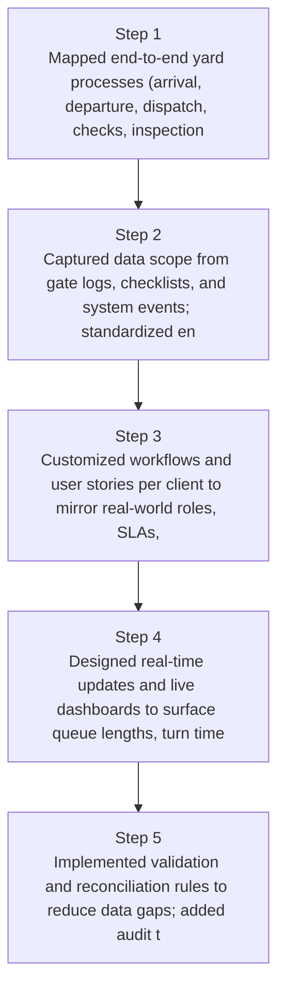
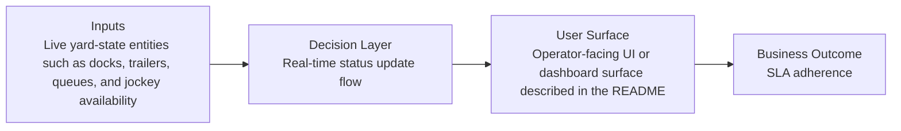
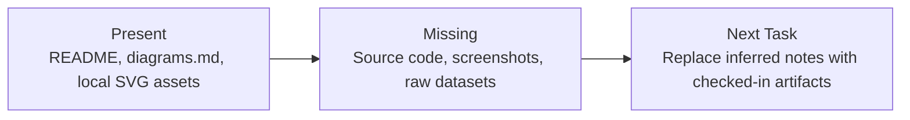

# Yard Management Platform Diagrams

Generated on 2026-04-26T04:29:37Z from README narrative plus project blueprint requirements.

## Yard platform architecture

## Real-time status update flow

## Evidence Gap Map

